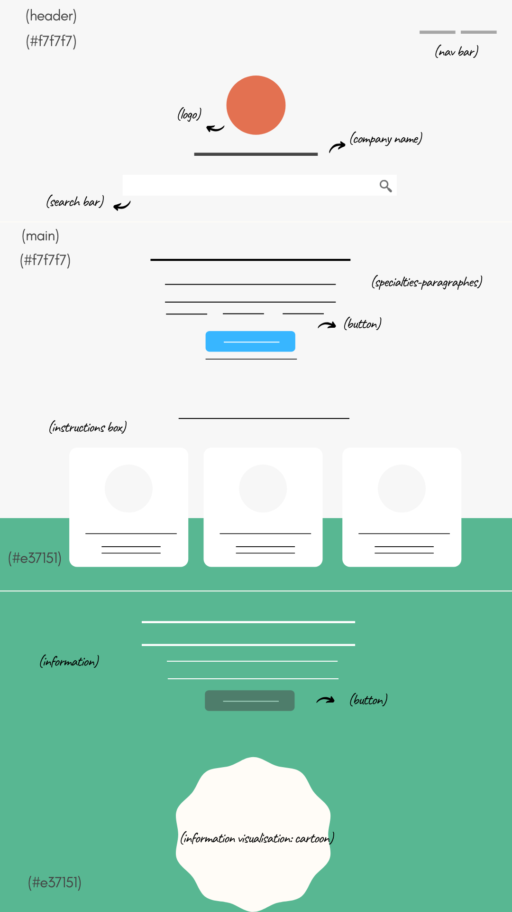
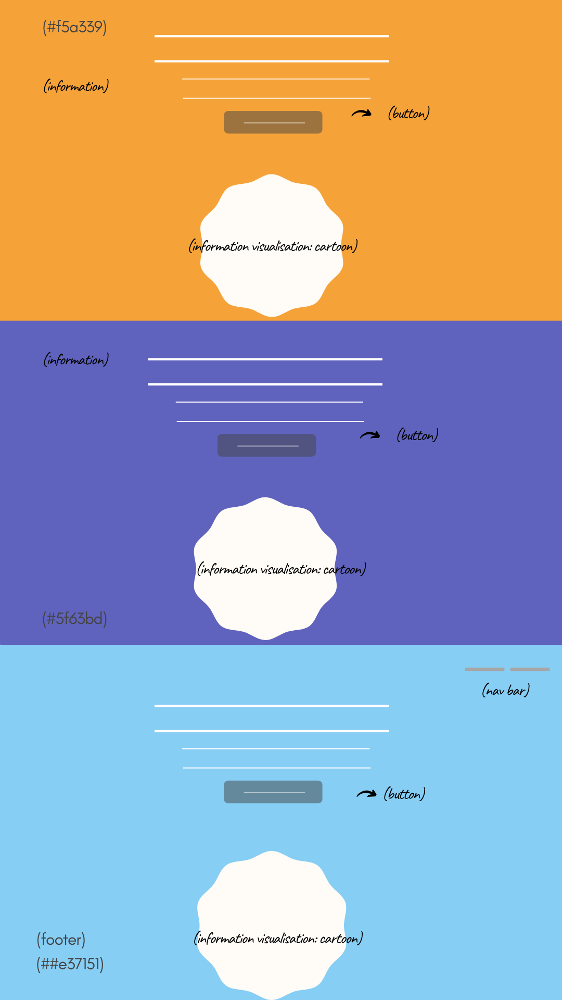

# Development Strategy

> `duck-duck-clone`

This project is one of assignment for students in HFY Coding Class. The main goal is to recreate the same or similar page to what has been assigned to. This project has two steps:
1.	Preparation, which means preparing the repo as needed, not only repository owner responsibility.
2.	The project is ready to clone and ready to make which means each collaborators start contributing their part on this project, as instructed on the development strategy. 
This project is good for those who want to train themselves in making website using HTML and CSS, including making a responsive design.

## Wireframe

<!-- include a wireframe for your project in this repository, and display it here -->
<!-- wireframe.cc is a good site for getting started with wireframes -->
Duck Duck Clone Wireframe  

## 0. Set-Up

__A User can see my initial repository and live demo__

### Repo, owner `Harun`

- Generate from Template
- Create basic files: prepare index.html (set-up the title on the head, link to css), add css (set-up class global container and body styles), and create a folder for images. Assigned to `Harun`
- Write initial, basic README: assigned to `Boam` 
- Complete Development Strategy: assigned to `everyone` via discussion, posted by `Yana`
- Create a wireframe: assigned to `Yana` , add to images folder and link it to development strategy
- Turn on GitHub Pages

## 1. User story: Landing on the homepage

_As a site visitor, I want to know what website I am seeing, to whom (or to which company) it belongs to_  
  
> Assigned to `Harun`  

### Branch(es)

1. Create an issue related to this user story on Github and assign self.
1. Add a branch named `title`
2. After html and css are done, commit
3. Adjust `development-strategy.md` for next development, if needed
4. Push the changes
4. Pull request and merge it on Github

### HTML

* Create header: company logo and company name

### CSS

* Add styling on new elements

---

## 2. User story: More about the page

_As a site visitor, I want to know what I can do in this website, what it is for_

> Assigned to `Harun`

### Branch(es)

1. Create an issue related to this user story on Github and assign self.
1. Add a branch named `search-bar`
2. After html and css are done, commit
3. Adjust `development-strategy.md` for next development, if needed
4. Push the changes
4. Pull request and merge it on Github

### HTML

* Add a search bar with placeholder “search the web without being tracked”

### CSS

* Add styling on new elements

---

## 3. User story: More about the company

_As a site visitor, I want to know more about the company other channels and more details information_

> Assigned to `Harun`

### Branch(es)

1. Create an issue related to this user story on Github and assign self.
1. Add a branch named `nav-bar`
2. After html and css are done, commit
3. Adjust `development-strategy.md` for next development, if needed
4. Push the changes
4. Pull request and merge it on Github

### HTML

* Add nav bar (as shown on the browser)

### CSS

* Add styling on new elements

---

## 4. User story: More about the business

_As a site visitor, I want to know what the business specialties from this company (duckduckgo)_

> Assigned to `Boam`

### Branch(es)

1. Create an issue related to this user story on Github and assign self.
1. Add a brach named `specialties`
2. After html and css are done, commit
3. Adjust `development-strategy.md` for next development, if needed
4. Push the changes
4. Pull request and merge it on Github

### HTML

1. Use section for the content (as shown on the browser) explaining the specialties of this services which is a privacy protection
1. Add button to add DuckDuckGo to browser

### CSS

* Add styling on new elements

---

## 5. User story: Interested in the benefit service offered

_As a site visitor, I am interested in this benefit that the company offers, so how should i do?_

> Assigned to `Boam`

### Branch(es)

1. Create an issue related to this user story on Github and assign self.
1. Add a brach named `instructions`
2. After html and css are done, commit
3. Adjust `development-strategy.md` for next development, if needed
4. Push the changes
4. Pull request and merge it on Github

### HTML

1. Use three boxes for the features (as shown on the browser)
1. Add icons inside the boxes

### CSS

* Add styling on new elements

---
## 6. User story: More information

_As a site visitor, I am interested in their service, I know how to get their service but I still need more information about the privacy protection that they mean_

> Assigned to `Yana`

### Branch(es)

1. Create an issue related to this user story on Github and assign self.
1. Add a brach named `info-1-no-data`
2. After html and css are done, commit
3. Adjust `development-strategy.md` for next development, if needed
4. Push the changes
4. Pull request and merge it on Github

### HTML

1. Use section to explain how the service of DuckDuckGo work: no personal data stored
1. Add comical image to entertain visitors
1. Add button to make sure they are able to access this service directly

### CSS

* Add styling on new elements

---

## 7. User story: More Information

_As a site visitor, I still want to know more what they can do and I want to see more comical image_

> Assigned to `Yana`

### Branch(es)

1. Create an issue related to this user story on Github and assign self.
1. Add a brach named `info-2-no-ads`
2. After html and css are done, commit
3. Adjust `development-strategy.md` for next development, if needed
4. Push the changes
4. Pull request and merge it on Github

### HTML

1. Use section to explain how the service of DuckDuckGo work: no ads following you
1. Add comical image to entertain visitors
1. Add button to make sure they are able to access this service directly

### CSS

* Add styling on new elements

---

## 8. User story: More Information

_As a site visitor, I can see new information and I am entertained by the comical images_

> Assigned to `Yana`

### Branch(es)

1. Create an issue related to this user story on Github and assign self.
1. Add a brach named `info-3-no-tracking`
2. After html and css are done, commit
3. Adjust `development-strategy.md` for next development, if needed
4. Push the changes
4. Pull request and merge it on Github

### HTML

1. Use section to explain how the service of DuckDuckGo work: no ads following you
1. Add comical image to entertain visitors
1. Add button to make sure they are able to access this service directly

### CSS

* Add styling on new elements

---

## 9. User story: More Information

_As a site visitor, I want to see what else they put on this page_

> Assigned to `Yana`

### Branch(es)

1. Create an issue related to this user story on Github and assign self.
1. Add a brach named `encouragement-section`
2. After html and css are done, commit
3. Adjust `development-strategy.md` for next development, if needed
4. Push the changes
4. Pull request and merge it on Github

### HTML

1. Use section to encourage visitors to use this service
1. Add comical image to entertain visitors
1. Add button to make sure they are able to access this service directly
1. Add internal nav bar to drive them back to the top of the page

### CSS

* Add styling on new elements

---

## 10. Finishing Touches

_As developers we want everything looks nice_

### Master

1. Create **an issue** related to what we want to change, for example: responsive design, background colour, etc.
1. Check the content, HTML, CSS, validate.
1. Validate the code to check for any last mistakes, **fix it**.
1. Write final, complete README and last touch on `development-strategy.md`, if still needed.
